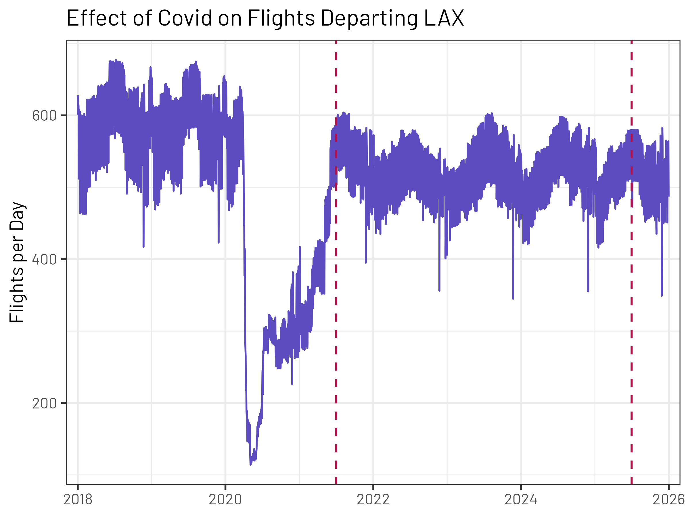
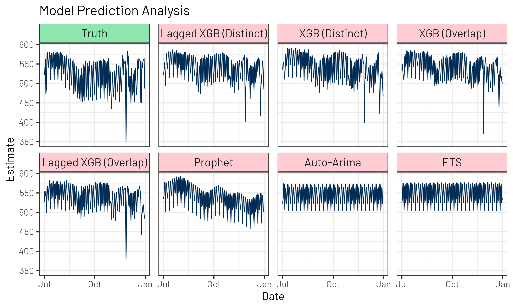
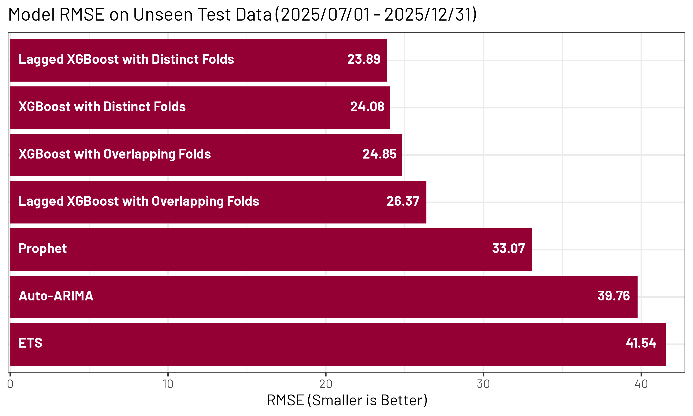
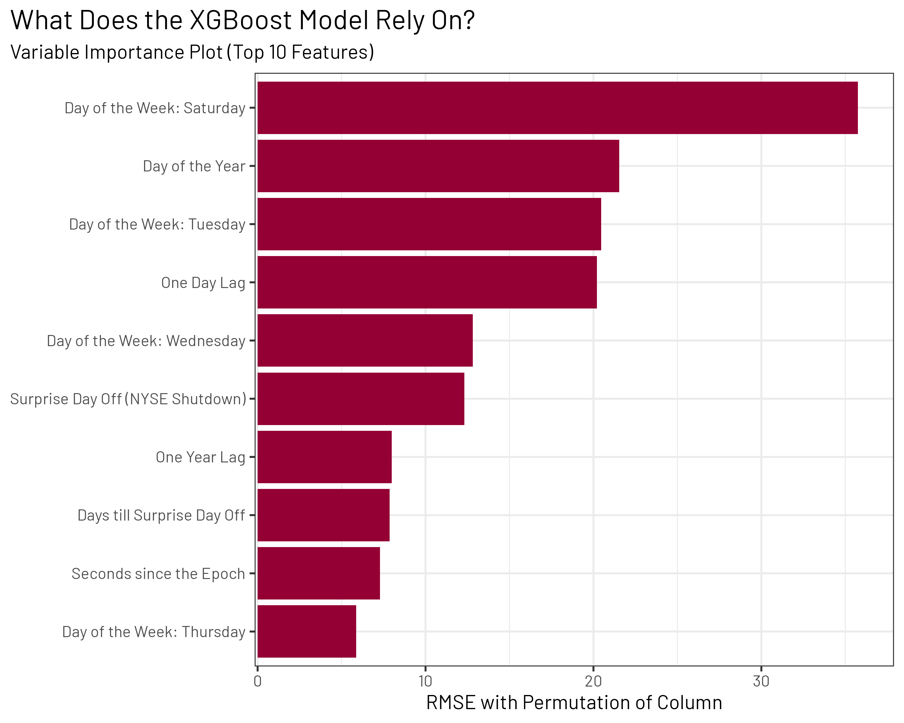

---

Note: All code is accessible at [github.com/kevbaer/Stats_170_Final_Project](https://github.com/kevbaer/Stats_170_Final_Project) for following along!

\newpage

# 1. Introduction

Life is, at its core, about the future. Some may disagree, but the past and present derive their power from the ability to influence the future.

I share this philosophy to lay out a foundation for my personal interest in prediction (or, as many in the time series community like to refer to as "Forecasting"). Predictive modeling empowers us to make better decisions for the future in all kinds of disciplines, from medicine to business to sports to weather. It also helps that prediction is worth a lot of money. Prediction markets are all the rage right now; Kalshi is currently valued at 23.7 billion dollars.[^1] Sports betting, financial trading, and insurance are some of the biggest industries in the world, and all revolve around the ability to predict the future better than competitors. So it follows that the best prediction algorithms (and people to implement them) are worth a lot of money too.

[^1]: <https://finance.yahoo.com/quote/KLSH.PVT/>

For example, in this new age of AI, some scientists in Germany at a company called Prior Labs started creating an LLM for predicting tabular data. TabPFN (or Tabular Prior-Data Fitted Network) uses synthetically created tabular datasets to serve as a learning corpus for more accurate prediction on the dataset you provide. Based on my understanding of the "public" sphere of predictive models in existence, it is the current state of the art. Their current technical report shows their models at the top, beating all sorts of classical and ensembled machine learning methods.[^2] One may note that I put public in quotes; indeed, TabPFN is only publicly available under a license that does not allow for commercial use.[^3] Furthermore, Prior Labs was acquired in May of 2026 by SAP, which Forbes ranks as the 164th biggest company in the world (and 10th biggest software company).[^4][^5] This acquisition, which comes with a guaranteed 1 billion euro investment, was for an undisclosed amount of money. Suffice to say, we're talking about a very valuable area of research and investment.

[^2]: <https://arxiv.org/pdf/2605.13986>

[^3]: You can, of course, pay them to let you use it for commercial purposes.

[^4]: <https://priorlabs.ai/blog-posts/priorlabs-next-chapter>

[^5]: <https://www.forbes.com/lists/global2000/>

As a student, being well-versed and comfortable using and discussing these models opens lots of doors. For example, I finished in second place[^6] in a hackathon hosted by the Cincinnati Reds (a Major League Baseball team) in February 2025.[^7] Ten months later, they offered me an internship and referenced my hackathon performance as part of what elevated me over other candidates! There are classes offered here at UCLA that cover these topics, my understanding (I haven't taken it yet) is that Stats 101c is the Statistics version, though I've taken CS m146 and CS m148, which also cover these methods fairly in depth as well.

[^6]: I personally feel that there was some cheating that occurred in this competition, but that's a story for another time.

[^7]: <https://www.kaggle.com/code/kevinbaer/predicting-future-playing-time>

What I'm referring to is the set of algorithms used for predictive modeling, also frequently called machine learning. The simplest model is typically linear regression, and you build up throughout the quarter, learning about various parametric and non-parametric models. In most classes I've seen, they stop with either the class of Random Forest / XGBoost, or cover Neural Networks. Some of these classes end with a Kaggle competition, similar to the Reds Hackathon referenced above. But all of these classes focus on tabular data. And here comes the rub: that doesn't help you when you get to time series datasets.

I'm not the first person to attempt to use XGBoost models for Time Series. This is a well-known plan used by big companies and researchers all around the world. Indeed, as I was conducting research for this paper[^8], I stumbled across an article about Chronos2, Amazon's fancy new Time Series Foundation Model (TSFM), which currently holds the top score on fev-bench, a time series benchmark leaderboard.[^9][^10][^11] The article, written by a machine learning engineer at the Belgian software company ML6, compares Chronos2 to a production-grade, tuned XGBoost pipeline.[^12] The XGBoost model proved victorious.

[^8]: I was actually just scrolling on GitHub, but if it works, it works.

[^9]: <https://www.amazon.science/blog/introducing-chronos-2-from-univariate-to-universal-forecasting>

[^10]: <https://arxiv.org/abs/2509.26468>

[^11]: <https://huggingface.co/spaces/autogluon/fev-bench>

[^12]: <https://www.ml6.eu/en/blog/chronos-2-meets-the-grid-forecasting-system-imbalance-with-a-time-series-foundation-model>

I love XGBoost models.[^13] I often use them for my projects without even considering alternative options; I just have that much faith. So it only felt reasonable to see how XGBoost compares to the methods we learned about in class, and to go through the work to figure out the best ways to handle problems that arise throughout.

[^13]: Just check out my GitHub ([github.com/kevbaer](github.com/kevbaer)).

# 2. Data Breakdown

For this project, I decided that I was interested in something related to airplane flight data. As an out of state student, this issue is near to my heart, and the almost one billion American passengers in the past year. Also, one of the most famous datasets in R, `nycflights13`, is about plane flights. Thankfully, the `anyflights` package allows for the collection of data about other airports, from which I downloaded data on all flights departing from LAX (Los Angeles International Airport). The original source of this data is the Bureau of Transportation Statistics.[^14] The variable of interest for my analysis is the number of departing flights, measured per day. Below, I plot all data from 2018 through 2025:

[^14]: [bts.gov](https://www.bts.gov/)

{fig-align="center" width="600"}

One standout is the harrowing impacts of the Covid-19 pandemic, which dropped flights to as low as one-third their previous average. Indeed, it appears from the data shown here that we haven't even recovered to that 2018-2020 average. For my analysis, I chose to start the dataset when the data appears to flatten back out, July 1st of 2021. So, each model is given a training quota of 4 years of data, conveniently with one leap day for a total number of 1461 rows. You can see each of those data points between the two dashed red lines in the above figure. After whatever training procedures each model works best with, there will be a separate unseen test dataset for the model's predictions to be compared to. This consists of 6 months' worth of data, the second half of 2025, July 1st to December 31st (184 rows), and is represented in the figure by the points to the right of the second red line.

# 3. Defining the Problem

What exactly am I setting out to accomplish? I want to compare some of the time series methods we learned about (as well as others that score highly on the `modeltime` introductory vignette[^15]) to the best XGBoost model that I can create relatively quickly (i.e. in the span of this project's real-world duration but also in the time it takes to run the code itself). I will measure performance on the held-out test set using the RMSE (Root Mean Squared Error) metric,[^16] which is a frequent choice for its penalization for larger mistakes[^17], but also recalibration to the same units as the data for ease of interpretability.

[^15]: <https://business-science.github.io/modeltime/articles/getting-started-with-modeltime.html>

[^16]: <https://yardstick.tidymodels.org/reference/rmse.html>

[^17]: Larger mistakes are typically considered more costly than a series of small mistakes adding up to an equivalent value.

It is not trivial to use XGBoost models for time series prediction. XGBoost models will not accept a date column as a predictor like we are familiar doing in this class. Furthermore, if you were to input it as a numeric column, the XGBoost model would likely have some trouble understanding the complex cyclical nature of the numeric set. Therefore, a major problem will be feature engineering, which is roughly defined as the modification of existing information (or columns) into a form which is easier for the model to use effectively.[^18]

[^18]: I firmly believe that feature engineering does not involve the "creation" of new information.

Another problem that will interrupt my typical XGBoost workflow is cross-validation. Cross-validation is a type of resampling method used to make your data act bigger than it is. Earlier, I wrote that the train set provided to each model is 1461 observations long. With a resampling method like cross-validation, observations can be used multiple times to allow the XGBoost parameters to be tuned more accurately. A typical cross-validation set-up involves 10 folds, where each fold is used nine times as part of a train set and the other time it serves as a test set against which the train set is evaluated. Unfortunately, in time series, this method wouldn't work, since future data can't be used to predict past data. So a special resampling method will have to be used for tuning the parameters effectively.

# 4. Feature Engineering

The training dataset begins as 1461 rows and 2 columns (date and flights_per_day). To modify our date column into a set of more useful features, the tk_augment_timeseries_signature() function from the `timetk` package creates a litany of new columns, including day of the week, month, week number inside the month, half, all sorts. This gives the date feature to the XGBoost model in a more familiar numeric listing, allowing it to notice cyclical patterns naturally, as if they were numeric predictors. Most of these columns will be converted to factors by prediction time. I also used tk_augment_holiday_signature() to add weekdays in which the New York Stock Exchange (NYSE) is shut down. This is my best proxy for noteworthy holidays, which people might be more likely to travel for. I also added a feature with the number of days until the next NYSE shutdown to predict travel in preparation for long weekends.[^19]

[^19]: Since the Tidyverse is not set up for multi-row feature engineering in this manner, I asked Gemini for code to create the feature. The first time did not work but after some modifications, I inspected the output and it matched my expectations. In hindsight, it would've been easier to have an external list of holiday dates to compare to rather than trying to do it inside the dataframe.

I reached a split in the road here when it came to adding lagged terms. On the one hand, one of the key features of ARIMA (and other classical time series models) is access to past values. However, this creates some complications for the XGBoost prediction, since the model needs to predict 184 values, so those lagged terms wouldn't necessarily exist. However, ARIMA (and other classical time series models) automagically use their predicted values as those lagged terms, and that didn't seem too difficult to set-up so I decided to do two XGBoost models, one with lagged year and lagged day features, and one without, for comparison of the impact.

# 5. Resampling

To start out with my attempt at time series cross-validation, I used the aptly named time_series_cv() function from the `timetk` package. This function bills itself as an updated version of the time series resampling functions found in the standard tidymodels package, `rsample`, where I typically use vfold_cv() from. However, when I inspected this function closely, I noticed some problematic behavior.

As I've learned working on this project, time series cross-validation is about creating chunks of training data that then get tested on held-out data. That is similar to regular cross-validation, but since they can't use future data in the train set, they are forced to reduce the size of the train set at the beginning of the training data, and then building up to the full train set for whatever prediction horizon one is interested in. The way that time_series_cv() carried this out was to make as large train sets as possible. I had it create 25 folds, and it started with the largest train set possible, 1277 observations (1461 - 184). However, every following fold had only one less train observation. This tipped me off that there is a lot of overlap in the test sets being used to evaluate each fold. This is problematic because a key feature of typical cross-validation is the independence of each validation set.

I chose to also investigate an alternative option, with its own downsides. The sliding_period() function from the `rsample` package creates chunks (I used each month as a chunk since the horizon was exactly 6 months long), and then slides through them. It begins by using the first chunk to predict the next six, then the first two chunks to predict the next six, and then so on. While there is still overlap here, the overlap is now smaller and filter out more quickly. The downside to this approach is that the first fold has 31 train points and 184 test points. This is a problematic train/test split.

To solve this problem, I removed the first 32 folds, leaving only the last ten and largest folds for use. Each of these folds had over 1000 train observations and so I felt good about their ability to determine the best tuning parameters for the XGBoost models.

# 6. Model Tuning

One well-known downside of the XGBoost model family is that it requires a lot of tuning compared to other models. Based on the specifications in the tidymodels family, XGBoost has six tunable parameters:

1.  tree_depth: Maximum depth of each tree
2.  learn_rate: How fast the boosting algorithm shifts (learns)
3.  loss_reduction: How much reduction is required for a new split to be worthwhile
4.  min_n: Minimum number of data points for a node to be able to be split further
5.  sample_size: Proportion of data fitted on each iteration
6.  trees: Number of trees in the ensemble

When the dataset is large (and heavy cross-validation is used), it can be quite computationally expensive to tune.[^20] I prefer to use a space-filling grid to have the best combination of coverage of the domain space and manual control of the number of permutations tested. This strategy often gets in the neighborhood of the best parameter combinations.

[^20]: I've ran XGBoost models that have tuned for greater than 6 hours.

The runtime on my computer was less than 5 minutes for each model[^21], which I considered more than reasonable. I then selected the group of parameters that performed the best in terms of RMSE in the cross-validation and fit on all of the training data. My XGBoost models are now ready to predict!

[^21]: I have an Apple MacBook m2 Pro and ran this over 8 cores. Your results may vary.

# 7. Modifying the Test Set and Recursive Lags

Unfortunately, because of the laissez-faire manner in which I did my feature engineering (I didn't use the fancy `recipes` package in the tidymodels universe), I had to redo all the edits that I previously made to the train dataframe to my final hold-out dataframe. However, because of the one-hot encoding, this actually got fairly complicated. I had to make sure all of the removed columns were the same despite the train and test datasets having different values.

I also needed to solve the recursion problem for the lagged XGBoost models. Although there's a function in `modeltime` called recursive(), I couldn't really figure out whether it was working as intended or not,[^22] so I ended up creating my own simple "for" loop and did it manually. Since there were only 184 prediction points, this went fast (\~2 seconds). However, this recursive strategy would not work as well if one were predicting thousands of points into the future.

[^22]: In the end, the values were the same so maybe it was working all along.

# 8. Non-XGBoost Models

I chose to train three "classical" time series models:

1.  ARIMA (using auto-arima for ideal terms with a max of 5 for each)
2.  Exponential Smoothing (using ETS for automated parameter selection)
3.  PROPHET (auto parameter selection)

Each of these could be worthy of an entire paper itself. I purposefully chose to use the most automated form of these models so I didn't have to set reasonable values myself. I am aware that each of these models can take other variables besides the standard date column.[^23] However, I did not attempt that here to keep these models as straight out of the box and simple as possible.

[^23]: Typically as part of a linear regression model.

Each of these models were given the full training dataset to work with and chose the best parameters based on fitting that data. They then predicted the next 184 day values.

# 9. Results

{fig-align="center" width="600"}

The above figure demonstrates what each of the seven models (four XGBoost and three Classical) predicted for the hold-out set of 184 days from July 1st, 2025, to December 31st, 2025. The top left graph is the true values that were seen at LAX over that time period. Some interesting notes: each of the XGBoost sets looks very similar. One difference is that the "Overlap" XGBoost models did a better job judging the depth of the drastic dip than the "Distinct" XGBoost models. I hypothesize this is because more of their folds had a similar 2024 dip in their validation set. I'll discuss this abnormal dip more later. The Prophet model has a really nice overall shape to it, but doesn't pick up on any of the extreme features or changes in variability. The Auto-Arima and ETS models default to a stationary state and look to underestimate the variance observed. These models are not terribly helpful in understanding the data.

{fig-align="center" width="600"}

The above figure shows the results on the hold-out dataset as measured by RMSE. The best performing model was the Lagged XGBoost with "Distinct" Folds.[^24] However, all four XGBoost models perform quite similarly. It's clear that the lagged columns are not adding a ton of information. It does seem that the distinct fold method performs better than the overlapping fold method.

[^24]: Note that the folds (as explained in section 5) are not actually distinct. I simply refer to them as "distinct" to differentiate from the higher overlap seen in the other resampling method. Apologies for this wording inaccuracy.

The Prophet model was unsurprisingly somewhere in between the performance of XGBoost and the other two classical models. I think with some more features and a better understanding of how this model works, I could likely produce a Prophet model with close to the results seen here by XGBoost.

So, in conclusion, the XGBoost models were substantially stronger than the classical models examined in this project. However, many limitations add more nuance to that statement.

# 10. Limitations and Future Possibilities

One limitation of this project is that it didn't account for the ability of these classical time series models to also have access to features like holiday flags or explicit seasonal patterns. A future project could investigate how much those factors would assist a model.[^25] Another limitation is that this project was run on a singular data set with some unique characteristics, and thus, the results might not hold for all other data sets.

[^25]: As mentioned above I think the Prophet model in particular could make large strides.

One particular unique characteristic is a very large drop off in terms of the number of flights that take place on Thanksgiving! Since the metric being used is RMSE, which is sensitive to large misses, all of the classical models got dinged severely for this data point. One future possibility is to try another metric which doesn't penalize large errors in particular.

One final limitation is the constant time difference between rows. I hypothesize that since each row had a constant time difference, the XGBoost model had an easier time interpolating than if the gaps were of different length. Potentially, then the other models would've had a stronger structure to assist in navigating the prediction process and gained an advantage over XGBoost for more similar performance.

One limitation I have not mentioned as of yet is interpretability. This is frequently cited as a limitation of XGBoost models. Although there is certainly some truth to that, one of my absolute favorite books, "Tidy Modeling with R" by Max Kuhn and Julia Silge features a great way to interpret all sorts of models.

{fig-align="center" width="580"}

Permutation-Based Variable Importance is a method in which the values of each column are reshuffled. I've never tried this method with time series before, and based on this figure, it definitely messes with the RMSE values since the independence condition is violated. I would consider this plot "just for fun" and would refrain from drawing strong conclusions.

However, the features that are important to the model are still visible, since they change the most upon permutation. It appears that the day of the week is quite impactful, potentially especially Saturday's (highest travel days) and Tuesday/Wednesday (low travel days). Also, the holiday features were very important, as well as the day of the year (potentially allowing for an adjustment for holiday time as the day of the year gets higher for November and December?)

More research could be done into how best to calculate permutation based variable importance for time series data, potentially using the same "sliding periods" that I explained in section 5.

# 11. Conclusion

I set out to explore the possibility of using XGBoost models for time series data, and I think I have succeeded! The models were accurate, fast, and (somewhat) interpretable. I also greatly enjoyed working on this. I will bring these lessons with me as I face future time series problems.

I also laid out a number of limitations and further areas of exploration for myself and/or others. This project certainly wasn't a conclusive or definitive guide, and I welcome suggestions for improvement.

All code can be found and reproduced at [github.com/kevbaer/Stats_170_Final_Project](https://github.com/kevbaer/Stats_170_Final_Project). I have linked many relevant websites and information throughout the paper itself, but I have also included a list of citations and other referenced works.

# 12. References

Chen T, He T, Benesty M, Khotilovich V, Tang Y, Cho H, Chen K, Mitchell R, Cano I, Zhou T, Li M, Xie J, Lin M, Geng Y, Li Y, Yuan J, Cortes D (2026). *xgboost: Extreme Gradient Boosting*. doi:10.32614/CRAN.package.xgboost <https://doi.org/10.32614/CRAN.package.xgboost>, R package version 3.2.1.1, <https://CRAN.R-project.org/package=xgboost>.

Couch S (2025). *anyflights: Query 'nycflights13'-Like Air Travel Data for Given Years and Airports*. doi:10.32614/CRAN.package.anyflights <https://doi.org/10.32614/CRAN.package.anyflights>, R package version 0.3.5, <https://CRAN.R-project.org/package=anyflights>.

Dancho M (2026). *modeltime: The Tidymodels Extension for Time Series Modeling*. doi:10.32614/CRAN.package.modeltime <https://doi.org/10.32614/CRAN.package.modeltime>, R package version 1.3.5, <https://CRAN.R-project.org/package=modeltime>.

Dancho M, Vaughan D (2025). *timetk: A Tool Kit for Working with Time Series*. doi:10.32614/CRAN.package.timetk <https://doi.org/10.32614/CRAN.package.timetk>, R package version 2.9.1, <https://CRAN.R-project.org/package=timetk>.

Domin I (2025). *ggview: 'ggplot2' Picture Previewer*. doi:10.32614/CRAN.package.ggview <https://doi.org/10.32614/CRAN.package.ggview>, R package version 0.2.2, <https://CRAN.R-project.org/package=ggview>.

Duong C, Taylor S, Letham B (2026). *prophet: Automatic Forecasting Procedure*. doi:10.32614/CRAN.package.prophet <https://doi.org/10.32614/CRAN.package.prophet>, R package version 1.1.7, <https://CRAN.R-project.org/package=prophet>.

Gao C (2026). *mirai: Minimalist Async Evaluation Framework for R*. doi:10.32614/CRAN.package.mirai <https://doi.org/10.32614/CRAN.package.mirai>, R package version 2.7.0, <https://CRAN.R-project.org/package=mirai>.

Kaplan J (2026). *fastDummies: Fast Creation of Dummy (Binary) Columns and Rows from Categorical Variables*. doi:10.32614/CRAN.package.fastDummies <https://doi.org/10.32614/CRAN.package.fastDummies>, R package version 1.7.6, <https://CRAN.R-project.org/package=fastDummies>.

Kuhn et al., (2020). Tidymodels: a collection of packages for modeling and machine learning using tidyverse principles. <https://www.tidymodels.org>

Kuhn, M., & Silge, J. (2022). *Tidy modeling with R*. O'Reilly Media.

Maksymiuk S, Gosiewska A, Biecek P (2020). “Landscape of R packages for eXplainable Artificial Intelligence.” *arXiv*. Pages 6, 7, 11, 15, <https://arxiv.org/abs/2009.13248>.

R Core Team (2025). *R: A Language and Environment for Statistical Computing*. R Foundation for Statistical Computing, Vienna, Austria. <https://www.R-project.org/>.

van den Brand T (2025). *ggh4x: Hacks for 'ggplot2'*. doi:10.32614/CRAN.package.ggh4x <https://doi.org/10.32614/CRAN.package.ggh4x>, R package version 0.3.1, <https://CRAN.R-project.org/package=ggh4x>.

Wickham H, Averick M, Bryan J, Chang W, McGowan LD, François R, Grolemund G, Hayes A, Henry L, Hester J, Kuhn M, Pedersen TL, Miller E, Bache SM, Müller K, Ooms J, Robinson D, Seidel DP, Spinu V, Takahashi K, Vaughan D, Wilke C, Woo K, Yutani H (2019). “Welcome to the tidyverse.” *Journal of Open Source Software*, *4*(43), 1686. doi:10.21105/joss.01686 <https://doi.org/10.21105/joss.01686>.

Wilke C, Wiernik B (2022). *ggtext: Improved Text Rendering Support for 'ggplot2'*. doi:10.32614/CRAN.package.ggtext <https://doi.org/10.32614/CRAN.package.ggtext>, R package version 0.1.2, <https://CRAN.R-project.org/package=ggtext>.
